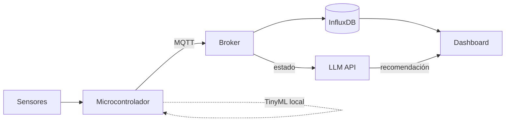

# 🏗️ Plantilla profesional — Proyecto integrador AI-IoT-Stack

> Copia este archivo como `readme.md` en la carpeta de tu equipo dentro de `assignments/proyectos/` y sustituye cada sección. Esta plantilla sigue el formato de documentación técnica que se espera en la industria; tu proyecto será evaluado con la rúbrica de [GRADING.md](../../GRADING.md) y los requisitos de [class-material/u6](../../class-material/u6/readme.md).

---

# Nombre del proyecto

**Equipo:** <!-- integrantes y no. de control -->
**Ciclo:** 2027
**Video demo:** <!-- enlace (3–5 min, flujo completo funcionando) -->

## 1. Resumen ejecutivo

<!-- 4–6 frases: qué problema real resuelve, para quién, y qué hace el sistema.
     Escríbelo para un gerente no técnico. -->

## 2. Arquitectura del sistema

<!-- Diagrama obligatorio (imagen o Mermaid) mostrando las capas del AI-IoT-Stack
     y cómo fluye el dato de extremo a extremo. -->



### Mapa de capas

| Capa del stack | Tecnología usada | Justificación de la elección |
|---|---|---|
| Percepción | <!-- sensores/actuadores --> | |
| Conectividad | <!-- WiFi/BT/LoRaWAN --> | |
| Mensajería | <!-- broker MQTT / EdgeX --> | |
| Persistencia | <!-- InfluxDB / otra --> | |
| **Inteligencia** | <!-- TinyML, LLM o ambas --> | |
| Visualización/acción | <!-- Grafana/ThingsBoard + actuador --> | |

## 3. Capa de inteligencia

<!-- La sección más importante. Describe: -->

- **Ruta elegida:** <!-- Edge (TinyML) / Nube (LLM) / ambas -->
- **Qué decide o infiere el sistema:**
- **Métrica que justifica la IA:** <!-- latencia de inferencia, ahorro de tráfico vs dato crudo,
     o comparación de la salida del LLM contra una regla fija — con números medidos -->
- **Límite de seguridad determinista:** <!-- qué decisión crítica NO depende de la IA y cómo está implementada -->

## 4. Hardware y materiales

| Componente | Cantidad | Costo aprox. | Real o simulado |
|---|---|---|---|
| | | | |

## 5. Reproducibilidad

<!-- Instrucciones paso a paso para que otra persona levante el sistema desde cero.
     Si no se puede reproducir, no está terminado. -->

```bash
# 1. Clonar y configurar
# 2. Variables de entorno / secretos (NUNCA en el repo — documenta cuáles se necesitan)
# 3. Levantar servicios (broker, base de datos, dashboard)
# 4. Flashear/simular el firmware
# 5. Verificación: qué debe verse cuando todo funciona
```

## 6. Resultados y métricas

<!-- Capturas del dashboard, tabla de mediciones, comportamiento del actuador.
     Incluye al menos: la métrica de la capa de inteligencia (sección 3) y
     una medición de estabilidad (tiempo corriendo, mensajes perdidos, etc.) -->

## 7. Limitaciones y trabajo futuro

<!-- Qué no alcanzó a funcionar, qué harían distinto, y qué sigue. La honestidad técnica suma puntos; ocultarla los resta. -->

## 8. Declaración de asistencia de IA

<!-- Obligatoria: completa el ANEXO.md del curso y enlázalo o inclúyelo aquí. -->

## 9. Referencias

<!-- Formato APA. Datasheets, documentación oficial, artículos, repositorios de terceros. -->
