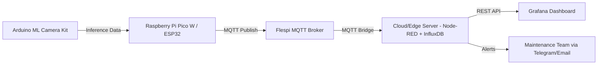

## 🚀 Propuesta: “Galgo Vision — Sistema de Control de Calidad Inteligente”

### 🎯 Objetivo

Implementar un sistema de inspección visual inteligente para manufactura usando una cámara con **Machine Learning** integrada en Arduino, que **detecte defectos o anomalías en productos** durante el proceso de fabricación.
Los datos e inferencias se transmitirán mediante **Flespi MQTT** hacia una plataforma de monitoreo en la nube (Grafana, Prometheus o Azure IoT Edge).

---

## 🧠 Arquitectura General



---

## ⚙️ Flujo de Operación

1. **Captura visual:**
   La cámara Arduino ML detecta un producto terminado y toma una imagen.
   Usa un modelo TinyML (TensorFlow Lite) entrenado para identificar defectos superficiales (rayas, color, forma).

2. **Inferencia local:**
   El modelo procesa la imagen en el microcontrolador (Edge AI).
   Resultado: *"OK"*, *"Defecto Tipo A"*, *"Defecto Tipo B"*, etc.

3. **Transmisión MQTT (vía Flespi):**
   El dispositivo envía un payload JSON con los datos:

   ```json
   {
     "device": "cam_galgo_01",
     "timestamp": "2025-11-04T22:15:00Z",
     "result": "Defecto Tipo A",
     "confidence": 0.87,
     "temperature": 28.5
   }
   ```

4. **Procesamiento Cloud/Edge:**
   Un nodo Node-RED o servidor en EC2/Azure IoT Edge almacena los datos en InfluxDB y activa alertas si se detectan patrones anómalos.

5. **Visualización:**
   Grafana muestra indicadores de defectos por hora, eficiencia de línea, tasa de falsos positivos, etc.

6. **Análisis predictivo (fase avanzada):**
   Los datos se entrenan en la nube (por ejemplo, con Python + scikit-learn o TensorFlow) para detectar tendencias de fallos recurrentes y mantenimiento preventivo.

---

## 🌐 Innovación Clave

| Área                    | Descripción                                                                       |
| ----------------------- | --------------------------------------------------------------------------------- |
| **Edge AI + IoT**       | Inferencia en el borde con Arduino ML Camera, sin depender de conexión constante. |
| **Cloudless Operation** | Flespi permite buffer de datos MQTT en desconexiones temporales.                  |
| **Calidad Predictiva**  | Los datos visuales alimentan modelos de predicción de defectos.                   |
| **Interfaz Multi-nube** | Se puede integrar con Azure IoT Hub, AWS IoT Core o EC2 open-source stack.        |
| **Ciberseguridad IoT**  | Autenticación JWT de Flespi y cifrado TLS para MQTT.                              |

---

## 🔩 Componentes Recomendados

* **Arduino Nicla Vision / Arduino ML Camera Kit**
  (con TensorFlow Lite y conectividad UART/I2C)
* **Raspberry Pi Pico W o ESP32**
  (para gestión MQTT → Flespi)
* **Flespi MQTT Broker**
  (para enrutamiento, almacenamiento temporal y API REST)
* **Node-RED + InfluxDB + Grafana stack**
  (para dashboard y análisis visual)
* **TinyML Model**
  Entrenado con Edge Impulse o TensorFlow Lite para detectar defectos visuales.

---

## 💡 Casos de uso reales

* Control de calidad en líneas de producción de **metal, textil o plásticos**.
* Clasificación de productos por color o forma.
* Rechazo automático de piezas defectuosas usando servomotores.
* Estadísticas de eficiencia y mantenimiento predictivo en Grafana.
