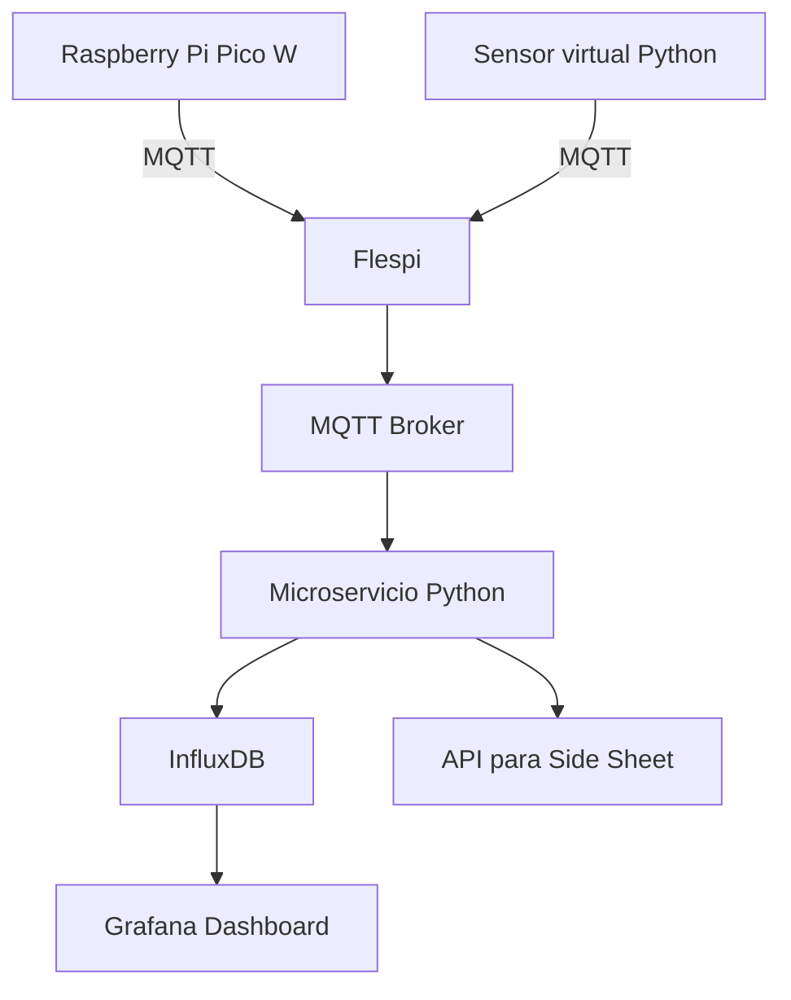

## 🏗️ **Desafío de Integración IoT: AURORA PLANT OPS v2.9 + Flespi MQTT**

**🎯 Contexto:**
Estás colaborando con un equipo de ingenieros OT/IT en el desarrollo de la solución de backend para el dashboard industrial **AURORA PLANT OPS v2.9**.
Tu objetivo: **simular e implementar una arquitectura IoT completa** que alimente el dashboard con datos reales en tiempo real a través de MQTT usando **[Flespi.com](https://flespi.com)** como broker central.

---

### 🧪 Escenario

🖥️ El dashboard está diseñado para pantallas industriales de gran tamaño y muestra datos como:

* OEE, Scrap, Disponibilidad
* Alertas en tiempo real (CRITICAL, WARNING)
* Mantenimiento predictivo
* Salud energética y de activos
* Línea de tiempo de órdenes de producción

---

## 🔧 **Objetivos Técnicos del Proyecto**

### 🧩 1. Simulación de Datos de Sensores (con Anomalías)

Crea un script `simulador_sensor.py` que publique a Flespi MQTT cada 10 segundos por máquina:

```json
{
  "machine_id": "M3",
  "timestamp": "2025-10-26T15:01:00Z",
  "oee": 0.87,
  "throughput_per_minute": 48,
  "scrap_rate_percent": 1.9,
  "availability_percent": 92.4,
  "temperature_c": 56.1,
  "vibration_mm_s": 3.2,
  "power_kw": 4.8,
  "status": "OK"
}
```

📉 Inyecta **anomalías simuladas**:

* Pico de vibración aleatorio (mayor a 10 mm/s)
* Caída repentina de disponibilidad (< 50%)

---

### 🧩 2. Diseño del Árbol de Tópicos MQTT

Ejemplo jerárquico para Flespi:

```
aurora/linea/L1/maquina/M1/metricas
aurora/linea/L2/maquina/M2/alertas
aurora/mantenimiento/predictivo/M4
```

---

### 🧩 3. Diagrama de Arquitectura IoT

Usa Mermaid.js para mostrar el flujo de datos completo:



---

### 🧩 4. Mantenimiento Predictivo

Diseña el cálculo de “riesgo de fallo”:

* Input: vibración (EMA), temperatura (delta), historial MTBF
* Output: `risk_score` y `recommendation` por máquina

---

### 🧩 5. Sistema de Alertas

Define el mapeo de alertas:

| Condición            | Severidad   | Color UI |
| -------------------- | ----------- | -------- |
| vibración > 10 mm/s  | CRÍTICO     | 🔴 Coral |
| scrap > 10%          | ADVERTENCIA | 🟠 Ámbar |
| disponibilidad < 70% | ADVERTENCIA | 🟠 Ámbar |
| Todo OK              | NORMAL      | 🟢 Verde |

---

### 🧩 6. Línea de Tiempo de Órdenes

Diseña un JSON tipo Gantt para OPs:

```json
{
  "order_id": "OP-9321",
  "product": "Valve Type X",
  "target_units": 400,
  "completed_units": 180,
  "eta": "2025-10-26T19:00:00Z",
  "stations": [
    {"name": "Corte", "start": "15:00", "end": "15:30"},
    {"name": "Soldadura", "start": "15:30", "end": "16:00"}
  ]
}
```

---

### 🧩 7. Modo Sala de Control (TV)

Lógica de endpoint para activar modo TV:

```
GET /tv_mode?enabled=true
```

Comportamientos:

* Oculta panel lateral
* Agrupa KPIs
* Muestra datos más densos

---

## 📦 Archivos del Proyecto Esperados

| Archivo               | Descripción                                   |
| --------------------- | --------------------------------------------- |
| `simulador_sensor.py` | Script con conexión a Flespi MQTT y anomalías |
| `topicos_mqtt.md`     | Árbol de tópicos y convenciones               |
| `arquitectura.mmd`    | Diagrama en Mermaid                           |
| `predictivo.py`       | Cálculo de riesgo y recomendaciones           |
| `alertas_mapper.py`   | Lógica para niveles de alerta                 |
| `timeline_op.json`    | JSON con formato Gantt                        |
| `README.md`           | Guía de uso, instalación, objetivos           |

---

## 📊 Rúbrica de Evaluación (20 pts totales)

| Criterio                            | Pts | Detalles                                          |
| ----------------------------------- | --- | ------------------------------------------------- |
| Simulador MQTT funcional con Flespi | 4   | Publica datos y anomalías                         |
| Diseño claro de tópicos             | 2   | Convención jerárquica                             |
| Diagrama completo de arquitectura   | 4   | Incluye sensores, broker, backend y visualización |
| Mantenimiento predictivo básico     | 3   | Lógica de cálculo y recomendación                 |
| Sistema de alertas codificado       | 2   | Códigos de color y condiciones                    |
| JSON de línea de tiempo OP          | 2   | Compatible con micro-Gantt                        |
| Documentación clara en README       | 3   | Explica dependencias, uso y mejoras               |

---

## 💡 Bonus (extra +3 pts)

* Visualización en Grafana real (Flespi + InfluxDB)
* Dockerfile o `docker-compose.yml` funcional
* Simulación de caída de paquetes PLC

---

