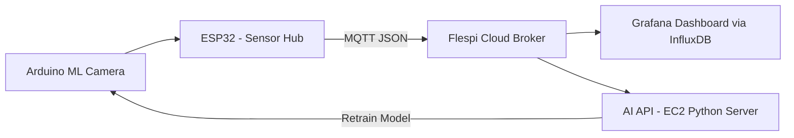

## 🌿 Proyecto: “Smart Plant Guardian — Edge AI para agricultura de precisión”

### 🎯 Objetivo

Ampliar tu sistema de monitoreo de plantas para **detectar visualmente el estado de salud del cultivo** (color, marchitez, plagas, crecimiento) mediante **Machine Learning en el borde (Edge)**, reduciendo el envío de datos y optimizando la respuesta local y en la nube.

---

### 🧠 Componentes principales

| Capa                  | Elemento                                                  | Descripción                                                                                                                            |
| --------------------- | --------------------------------------------------------- | -------------------------------------------------------------------------------------------------------------------------------------- |
| **Sensor/Edge**       | **Arduino ML Camera Kit (Nicla Vision / OpenMV)**         | Captura imágenes y ejecuta un modelo TensorFlow Lite para clasificar el estado de la planta (“Sana”, “Sedienta”, “Enferma”, “Plagas”). |
| **Microcontrolador**  | ESP32 / Raspberry Pi Pico W                               | Recolecta datos de humedad, temperatura y luminosidad. Coordina con la cámara y envía resultados por MQTT.                             |
| **Conectividad**      | **Flespi MQTT**                                           | Broker para comunicación entre dispositivo y servicios en la nube. Facilita dashboards y APIs REST.                                    |
| **Cloud / Edge AI**   | Raspberry Pi / EC2 con **Grafana + InfluxDB + Flask API** | Visualiza métricas, alertas, e integra imágenes clasificadas.                                                                          |
| **Análisis avanzado** | Python (NumPy, scikit-learn, OpenCV)                      | Entrena y actualiza el modelo de visión basado en imágenes de las plantas del entorno real.                                            |

---

### 🔄 Flujo de datos



---

### 💡 Características innovadoras

1. **AI en el borde (TinyML):**
   La cámara corre un modelo liviano (CNN) para clasificación local sin necesidad de conexión constante.

2. **MQTT Inteligente:**
   Solo envía datos a Flespi cuando el modelo detecta anomalías (ahorro de ancho de banda).

3. **Aprendizaje continuo:**
   Las imágenes clasificadas erróneamente son reenviadas al servidor (EC2) para reentrenar el modelo y devolverlo al dispositivo.

4. **Dashboards dinámicos:**
   Flespi → InfluxDB → Grafana muestran:

   * Estado actual de cada planta.
   * Histogramas de humedad y temperatura.
   * Conteo semanal de detecciones de plagas o estrés.

---

### ⚙️ Ejemplo de payload MQTT (Flespi topic `/smartplant/data`)

```json
{
  "device_id": "PLANT001",
  "timestamp": "2025-11-04T10:12:33Z",
  "soil_moisture": 42,
  "temperature": 26.3,
  "humidity": 58,
  "plant_status": "Thirsty",
  "confidence": 0.91
}
```

---

### 🌍 Impacto real

* **Sostenibilidad:** Reduce riego innecesario y optimiza recursos hídricos.
* **Escalabilidad:** Puede implementarse en viveros, invernaderos o cultivos urbanos.
* **Edge Intelligence:** La cámara actúa como nodo autónomo con decisión local.
* **Educativo:** Integra visión artificial, MQTT y visualización IoT en un solo ecosistema.

---
