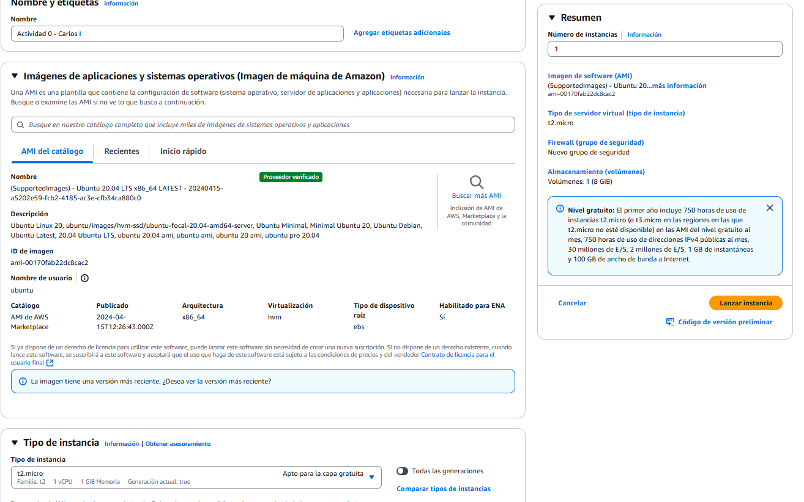
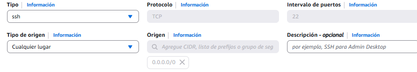
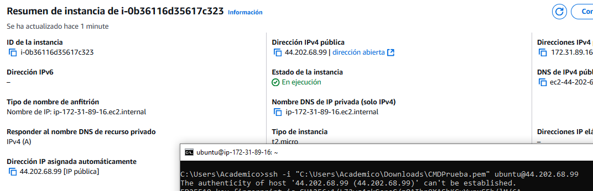
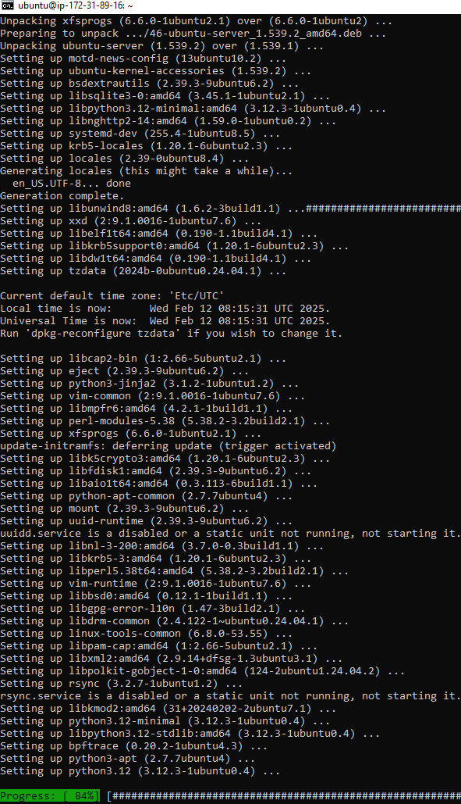
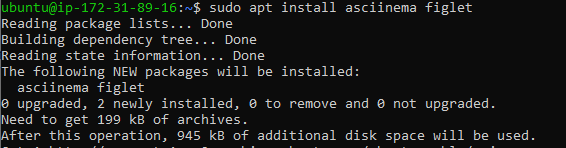
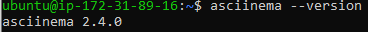

#### 📌 Actividad 0 - AWS
**Nombre:** Carlos Alberto Iñiguez Gallego 
**Número de Control:** 19211660 
**GitHub:** [CarlosAlberto193](https://github.com/CarlosAlberto193)

## 1️⃣Crear Instancia de Ubuntu 20.04 LTS1️⃣
**Primer Paso:**  Basandome en las ordenes dadas, elegi Ubuntu 20.04 LTS en un procesador de 64bits, del mismo modo tambien la instancia t2.micro mas que nada por que dice que este es gratis, tambien le di el nombre de esta actividad.

  

**Segundo Paso:**  Solamente me cerciore de contar con el puerto 22 abierto a ingreso SSH.

  

## 2️⃣Conexion SSH2️⃣
**Tercer Paso:**  Debido a que no tenia PuTTY instalado en este sistema, preferi por utilizar la aplicacion de SSH que viene por determinado en el cmd de Windows 10, en este caso solamente hice referencia a la llave de la instancia y su IP abierta.

  

**Cuarto Paso:**  Esta es solo una prueba de CMD y yo siguiendo los comandos dados en la actividad.

  

## 3️⃣Instalar ASCIINEMA3️⃣

  

  

## 4️⃣Evidencia de ASCIINEMA4️⃣

