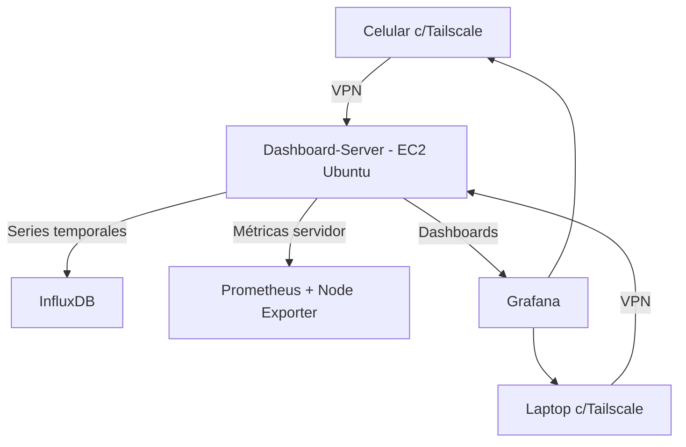

## 🧪 Práctica 3: Monitoreo IoT con InfluxDB, Prometheus y Grafana en EC2 + Tailscale

### 🎯 Objetivo de aprendizaje

* Instalar y configurar un stack de monitoreo IoT en **Ubuntu Server**.
* Conectar el servidor y dispositivos personales mediante **Tailscale VPN**.
* Inyectar datos **RAW simulados** en **InfluxDB**.
* Crear dashboards académicos en **Grafana** combinando datos de **InfluxDB (IoT)** y **Prometheus (infraestructura)**.

### 🖥️ Infraestructura inicial

* **Instancia EC2 Ubuntu Server** recién creada (solo puerto 22 abierto).
* **Laptop + Celular** con **Tailscale** instalado.
* Cuenta Gmail personal (no institucional) para autenticación.

---

## 1. Conectar la EC2 con Tailscale

1. Desde la EC2, instala Tailscale y conecta la máquina a tu red:

   ```bash
   curl -fsSL https://tailscale.com/install.sh | sh
   sudo tailscale up --ssh --hostname=dashboard-server
   ```

   El parámetro `--ssh` habilita Tailscale SSH en la instancia, mientras que `--hostname` asigna un nombre fácilmente identificable en el panel de administración.

2. En la laptop y el celular instala la aplicación **Tailscale** y accede con tu cuenta de Gmail.

3. Verifica en [https://login.tailscale.com/admin/machines](https://login.tailscale.com/admin/machines) que los tres nodos aparezcan conectados.

---

## 2. Instalar InfluxDB 2.x

La herramienta `apt-key` está obsoleta en las versiones recientes de Ubuntu, por lo que las claves GPG deben almacenarse en `trusted.gpg.d`. Utiliza el siguiente procedimiento, que agrega el repositorio oficial y firma la clave correctamente:

```bash
# Descarga y verifica la clave de InfluxData
wget -q https://repos.influxdata.com/influxdata-archive_compat.key
echo '393e8779c89ac8d958f81f942f9ad7fb82a25e133faddaf92e15b16e6ac9ce4c influxdata-archive_compat.key' | sha256sum -c

# Convierte la clave a formato gpg y la instala
cat influxdata-archive_compat.key | gpg --dearmor | sudo tee /etc/apt/trusted.gpg.d/influxdata-archive_compat.gpg >/dev/null

# Añade el repositorio estable de InfluxDB
echo "deb [signed-by=/etc/apt/trusted.gpg.d/influxdata-archive_compat.gpg] https://repos.influxdata.com/ubuntu $(lsb_release -cs) stable" | sudo tee /etc/apt/sources.list.d/influxdb.list

# Actualiza e instala InfluxDB
sudo apt update
sudo apt install influxdb-client influxdb -y

# Habilita y arranca el servicio
sudo systemctl enable --now influxdb
```

Una vez instalado, abre la interfaz web desde tu laptop mediante Tailscale:

```
http://<ip-tailscale-de-ec2>:8086
```

Sigue el asistente para crear la organización (`iot-lab`), el bucket (`sensores`) y copia el token de escritura.

Manual en linea: https://docs.influxdata.com/influxdb/v2/install/?t=Linux#start-influxdb  

---

## 3. Instalar Prometheus y Node Exporter

### Descargar y configurar Prometheus

Actualmente la rama de soporte a largo plazo (LTS) es la serie 3.x (publicada en julio 2025), mientras que la serie 2.53 está en mantenimiento hasta julio 2025. Se recomienda emplear la versión LTS más reciente. Sustituye `<VERSION>` por la versión elegida (por ejemplo, `3.5.0`):

```bash
# Descarga el tarball oficial de Prometheus (sustituye <VERSION>)
wget https://github.com/prometheus/prometheus/releases/download/v<VERSION>/prometheus-<VERSION>.linux-amd64.tar.gz
tar xvfz prometheus-*.tar.gz

# Mueve los binarios y configura el directorio de datos
sudo mv prometheus-*/prometheus /usr/local/bin/
sudo mv prometheus-*/promtool /usr/local/bin/
sudo mkdir -p /etc/prometheus /var/lib/prometheus
sudo mv prometheus-*/consoles /etc/prometheus
sudo mv prometheus-*/console_libraries /etc/prometheus
```

Crea el archivo de configuración `/etc/prometheus/prometheus.yml` con un intervalo de scrape corto (5 s) y define los targets de Prometheus y Node Exporter:

```yaml
global:
  scrape_interval: 5s

scrape_configs:
  - job_name: 'prometheus'
    static_configs:
      - targets: ['localhost:9090']
  - job_name: 'node'
    static_configs:
      - targets: ['localhost:9100']
```

Genera un servicio systemd para Prometheus. Después de crear o modificar archivos de unidad, es necesario recargar la configuración de systemd mediante `systemctl daemon‑reload`:

```bash
sudo tee /etc/systemd/system/prometheus.service <<'EOF'
[Unit]
Description=Prometheus
After=network.target

[Service]
ExecStart=/usr/local/bin/prometheus \
  --config.file=/etc/prometheus/prometheus.yml \
  --storage.tsdb.path=/var/lib/prometheus \
  --web.listen-address=:9090
Restart=always

[Install]
WantedBy=multi-user.target
EOF

# Recarga la configuración de systemd y habilita el servicio
sudo systemctl daemon-reload  # recarga los archivos de unidad modificados:contentReference[oaicite:3]{index=3}
sudo systemctl enable --now prometheus
```

Prometheus quedará accesible a través de Tailscale en:

```
http://<ip-tailscale-de-ec2>:9090
```

### Instalar Node Exporter

Descarga la última versión de **Node Exporter** desde la página de lanzamientos de GitHub y crea un servicio. El proyecto recomienda descargar el tarball y ejecutar el binario resultante. Sustituye `<VERSION>` por la versión actual (por ejemplo, `1.9.1`):

```bash
wget https://github.com/prometheus/node_exporter/releases/download/v<VERSION>/node_exporter-<VERSION>.linux-amd64.tar.gz
tar xvfz node_exporter-*.tar.gz
sudo mv node_exporter-*/node_exporter /usr/local/bin/

sudo tee /etc/systemd/system/node_exporter.service <<'EOF'
[Unit]
Description=Node Exporter
After=network.target

[Service]
ExecStart=/usr/local/bin/node_exporter
Restart=always

[Install]
WantedBy=multi-user.target
EOF

sudo systemctl daemon-reload    # recarga la definición del servicio:contentReference[oaicite:5]{index=5}
sudo systemctl enable --now node_exporter
```

---

## 4. Instalar Grafana

Agrega el repositorio oficial de Grafana y firma su clave GPG (similar a InfluxDB). Luego instala y arranca el servicio:

```bash
sudo apt-get install -y apt-transport-https software-properties-common
wget -q -O - https://packages.grafana.com/gpg.key | sudo gpg --dearmor -o /etc/apt/trusted.gpg.d/grafana.gpg
echo "deb [signed-by=/etc/apt/trusted.gpg.d/grafana.gpg] https://packages.grafana.com/oss/deb stable main" | sudo tee /etc/apt/sources.list.d/grafana.list

sudo apt update
sudo apt install grafana -y
sudo systemctl enable --now grafana-server
```

Accede a Grafana por medio de Tailscale en:

```
http://<ip-tailscale-de-ec2>:3000
```

Usuario y contraseña inicial: `admin/admin` (se solicitará cambiarla en el primer acceso). Configura los **datasources**:

* **InfluxDB**: tipo InfluxDB v2, con URL `http://localhost:8086`, token copiado del paso 2, organización `iot-lab` y bucket `sensores`.
* **Prometheus**: URL `http://localhost:9090`.

---

## 5. Simular datos RAW en InfluxDB

Para simular lecturas de sensores, instala el cliente Python y ejecuta un script que envía datos cada 5 segundos:

```bash
sudo apt install python3-pip -y
pip3 install influxdb-client
```

Crea `simulador.py` con el token obtenido previamente:

```python
from datetime import datetime
import random
import time
from influxdb_client import InfluxDBClient, Point, WritePrecision

token = "TU_TOKEN"
org = "iot-lab"
bucket = "sensores"

client = InfluxDBClient(url="http://localhost:8086", token=token, org=org)
write_api = client.write_api()

while True:
    temp = random.uniform(18, 30)
    hum = random.uniform(40, 70)
    point = (
        Point("ambiente")
        .tag("ubicacion", "laboratorio")
        .field("temperatura", temp)
        .field("humedad", hum)
        .time(datetime.utcnow(), WritePrecision.NS)
    )
    write_api.write(bucket=bucket, record=point)
    print(f"Enviado: temp={temp:.2f}, hum={hum:.2f}")
    time.sleep(5)
```

Ejecuta el simulador en la EC2:

```bash
python3 simulador.py
```

---

## 6. Crear dashboards en Grafana

1. Ingresa a Grafana y crea un nuevo **Dashboard**.
2. Añade un **panel** para la temperatura y otro para la humedad usando la fuente de datos **InfluxDB**. Selecciona la medición `ambiente` y los campos `temperatura` y `humedad`.
3. Añade un panel de **Prometheus** para mostrar métricas del servidor (por ejemplo, `node_cpu_seconds_total` para CPU o `node_memory_MemAvailable_bytes` para memoria). El sitio oficial describe que las métricas exportadas por Node Exporter se exponen en `localhost:9100` y se habilitan en Prometheus usando `scrape_configs`.

---

## 7. Entregables del estudiante

1. **Captura de pantalla** del panel de administración de Tailscale mostrando el nodo `dashboard-server`.
2. **Dashboard de Grafana** donde se visualicen los datos de InfluxDB y las métricas de Prometheus.
3. **Código Python** utilizado para la simulación de datos.
4. **Explicación escrita** que conteste:

   * ¿Por qué es útil Tailscale en este escenario? (responde que permite conectar nodos mediante VPN sin exponer puertos públicos).
   * Diferencia entre las métricas de **IoT (InfluxDB)** y las métricas de **sistema (Prometheus/Node Exporter)**.

---

## 📊 Diagrama (Mermaid)



---

### Comentarios finales

* **Recarga de systemd**: recuerda usar `systemctl daemon‑reload` cada vez que crees o edites un servicio para que systemd cargue las nuevas unidades. La opción `daemon‑reexec` reejecuta el gestor de systemd; su uso está destinado a depuración o actualizaciones del propio systemd y no es necesario en este contexto.
* **Uso de claves GPG**: evita el uso de `apt-key` (obsoleto). En su lugar, almacena las claves en `/etc/apt/trusted.gpg.d` como muestra la guía.


---

# 📑 Rúbrica de Evaluación – Práctica Monitoreo IoT en EC2 con InfluxDB, Prometheus y Grafana

| Criterio                                            | Excelente (100%)                                                                                                               | Satisfactorio (80%)                                                         | Básico (60%)                                             | Deficiente (40% o menos)                                 |
| --------------------------------------------------- | ------------------------------------------------------------------------------------------------------------------------------ | --------------------------------------------------------------------------- | -------------------------------------------------------- | -------------------------------------------------------- |
| **Configuración de Tailscale** (20%)                | Instalación y conexión de EC2, laptop y celular correctamente, con nombre de nodo definido y evidencia en panel.               | Instalación completa, pero sin hostname o con un nodo faltante.             | Conexión parcial (ej. solo EC2 y un dispositivo).        | No logró conectar con Tailscale o no presenta evidencia. |
| **Instalación de InfluxDB** (15%)                   | InfluxDB instalado con repositorio actualizado (sin `apt-key`), servicio habilitado y bucket/token creados.                    | InfluxDB instalado pero con pasos incompletos (ej. bucket no creado).       | Instalación funcional pero con errores de configuración. | No se logró instalar ni acceder a InfluxDB.              |
| **Instalación de Prometheus + Node Exporter** (15%) | Prometheus en versión estable/LTS, Node Exporter activo, archivo `prometheus.yml` configurado y servicios systemd funcionando. | Prometheus o Node Exporter instalados con errores menores en configuración. | Instalación parcial (ej. solo Prometheus o sin systemd). | No se ejecutan métricas o falla la instalación.          |
| **Instalación de Grafana** (15%)                    | Grafana funcionando, con datasources configurados (InfluxDB y Prometheus) y acceso seguro por Tailscale.                       | Grafana instalado pero con un datasource incompleto o con errores menores.  | Grafana accesible pero sin datasources configurados.     | No se logra acceder a Grafana o no se instala.           |
| **Simulación de datos IoT** (15%)                   | Script Python funcionando, enviando datos periódicos a InfluxDB con impresión en consola y bucket actualizado.                 | Script ejecutado pero sin escritura continua o con errores de formato.      | Script incompleto o sin conexión a InfluxDB.             | No entrega el script o no ejecuta.                       |
| **Dashboard en Grafana** (15%)                      | Dashboard con paneles claros: temperatura, humedad (InfluxDB) y métricas de CPU/memoria (Prometheus).                          | Dashboard creado pero con paneles incompletos o mal configurados.           | Dashboard básico con solo un tipo de métrica.            | No entrega dashboard o está vacío.                       |
| **Informe escrito y reflexiones** (5%)              | Explicación clara sobre uso de Tailscale y diferencia entre métricas IoT (InfluxDB) y sistema (Prometheus).                    | Explicación entregada pero incompleta en uno de los puntos.                 | Explicación poco clara o superficial.                    | No entrega explicación.                                  |

---

## 🔢 Escala de calificación

* 90 – 100: Dominio completo, práctica impecable y reflexión crítica.
* 80 – 89: Cumple con casi todos los puntos, errores menores.
* 70 – 79: Cumplimiento parcial, pero práctica funcional.
* < 70: Práctica incompleta o sin funcionalidad.

---


