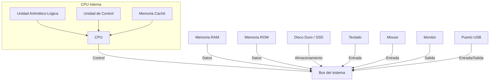

# Arquitectura de los Sistemas Programables

## Componentes clave: CPU, Memoria, Buses, Periféricos

**Autora:** Fonseca Novelo Alfonso Humberto
**Numero:** 22211562

---

## Índice

1. [Introducción](#introducción)  
2. [La CPU: El cerebro del sistema](#la-cpu-el-cerebro-del-sistema)  
3. [Memoria: Donde viven los datos](#memoria-donde-viven-los-datos)  
4. [Buses: Las autopistas de los datos](#buses-las-autopistas-de-los-datos)  
5. [Periféricos: La puerta al mundo exterior](#periféricos-la-puerta-al-mundo-exterior)  
6. [Referencias](#referencias)

---

## Introducción

Los sistemas programables están en el corazón de casi todos los dispositivos tecnológicos modernos, desde computadoras y teléfonos hasta electrodomésticos inteligentes. Para entender cómo funcionan, es clave conocer los componentes que los forman: la CPU, la memoria, los buses y los periféricos. En este documento vamos a revisar estos elementos de forma clara y directa, sin complicaciones innecesarias.

---

## La CPU: El cerebro del sistema

La **Unidad Central de Procesamiento (CPU)** es donde se ejecutan las instrucciones de los programas. Su función principal es procesar datos y controlar el funcionamiento del resto del sistema.

### Componentes internos de la CPU:

- **Unidad Aritmético-Lógica (ALU)**: Realiza operaciones matemáticas y lógicas.
- **Unidad de Control**: Coordina y dirige todas las operaciones.
- **Registros**: Espacios pequeños de almacenamiento para operaciones rápidas.

La CPU trabaja en conjunto con la memoria, tomando instrucciones y datos, procesándolos, y devolviendo resultados. Su velocidad se mide en **GHz (gigahercios)**, pero también importa la arquitectura interna y el número de núcleos.

> Fuente: Wikimedia Commons

---

## Memoria: Donde viven los datos

La memoria es el espacio donde se almacenan temporalmente los datos y las instrucciones que necesita la CPU.

### Tipos principales:

- **Memoria RAM (Memoria de Acceso Aleatorio)**: Volátil, rápida, se borra al apagar el sistema.
- **Memoria ROM (Memoria de Solo Lectura)**: No volátil, contiene instrucciones esenciales del sistema.
- **Caché**: Memoria súper rápida integrada en la CPU, usada para acelerar el acceso a los datos más usados.
- **Memoria secundaria**: Como discos duros o SSD, no es parte de la memoria principal, pero almacena datos de forma permanente.

La comunicación entre CPU y memoria debe ser rápida, y por eso la estructura y organización de la memoria es tan importante como su capacidad.

---

## Buses: Las autopistas de los datos

Los **buses** son canales que permiten la transferencia de datos entre los diferentes componentes del sistema: CPU, memoria y periféricos. Son esenciales para que todo el sistema funcione de forma coordinada.

### Tipos de buses:

- **Bus de datos**: Transporta los datos que se están procesando.
- **Bus de direcciones**: Indica a qué parte de la memoria o qué dispositivo se quiere acceder.
- **Bus de control**: Lleva señales que gestionan el funcionamiento del sistema (lectura, escritura, interrupciones, etc.).

La velocidad del bus influye directamente en el rendimiento del sistema. Un bus más ancho (por ejemplo, de 64 bits en lugar de 32) puede mover más datos a la vez.

> Fuente: Wikimedia Commons

---

## Periféricos: La puerta al mundo exterior

Los **periféricos** permiten que el sistema interactúe con el usuario o con otros sistemas. Pueden ser dispositivos de entrada, salida o ambos.

### Clasificación:

- **Entrada**: Teclado, mouse, micrófono, escáner.
- **Salida**: Monitor, impresora, altavoces.
- **Entrada/Salida**: Pantallas táctiles, discos externos, memorias USB.

Estos dispositivos se comunican con la CPU a través de **controladores** y pueden estar integrados (como el teclado en una laptop) o conectarse externamente.

> Nota: Hoy en día, muchos periféricos usan interfaces como USB, Bluetooth o incluso Wi-Fi para comunicarse con el sistema.

---

## Referencias

- Tanenbaum, A. S., & Bos, H. (2015). *Modern Operating Systems* (4ª ed.). Pearson.  
  [https://www.pearson.com/store/p/modern-operating-systems/P100000774781](https://www.pearson.com/store/p/modern-operating-systems/P100000774781)

- Stallings, W. (2018). *Computer Organization and Architecture* (11ª ed.). Pearson.  
  [https://williamstallings.com/Computer-Organization-Architecture/](https://williamstallings.com/Computer-Organization-Architecture/)

- GeeksforGeeks. (2021). [Basic Components of a Computer System](https://www.geeksforgeeks.org/basic-components-of-a-computer-system/)

- IBM Documentation. (n.d.). [System Bus](https://www.ibm.com/docs/en/power9?topic=architecture-system-bus)

- Intel. (n.d.). [What is a CPU?](https://www.intel.com/content/www/us/en/products/docs/processors/what-is-a-cpu.html)

---

