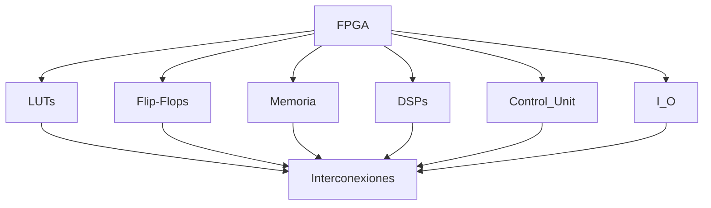

# Introducción a FPGA y Computación Reconfigurable  
**Autor:** Cesar Michael Perez Garcia  
**Número de control:** 22210332  

---

## Introducción  

La computación reconfigurable, basada en dispositivos como las **FPGA (Field Programmable Gate Arrays)**, ha transformado el diseño digital al permitir la personalización del hardware para aplicaciones específicas. A diferencia de los procesadores tradicionales con arquitecturas fijas, las FPGA ofrecen flexibilidad: su lógica interna puede adaptarse y reprogramarse para distintos algoritmos, optimizando parámetros como el rendimiento, consumo energético o latencia.

---

## Lógica Programable  

Las FPGA son dispositivos de lógica programable, compuestos por bloques de hardware configurables interconectados, donde el diseñador define su función mediante una configuración que se carga en el dispositivo.

**Ventajas importantes:**

- **Adaptabilidad:** un mismo FPGA puede reutilizarse en diferentes proyectos o funciones.  
- **Optimización:** permite adaptar hardware para lograr mejor desempeño o menor consumo que si se usara solo software en CPU/GPU.  
- **Utilidad en aplicaciones exigentes:** inteligencia artificial, telecomunicaciones, visión por computadora, sistemas embebidos, cómputo en el borde (edge computing), etc.

---

## LUTs (Look-Up Tables)  

El elemento fundamental en muchas FPGA es la **LUT (Look-Up Table):**

- Es básicamente una tabla de verdad programable: para un número dado de entradas, define la salida para cada combinación de entrada.  
- Permite implementar funciones booleanas arbitrarias dentro de la limitación de su tamaño (por ejemplo, una LUT de 6 entradas puede decidir sobre \(2^6 = 64\) posibles combinaciones).  
- Combinadas con flip-flops (para almacenamiento de estado), multiplexores, etc., forman las celdas lógicas básicas.  
- El tejido completo de LUTs y los interconectores (“interconexiones”) entre ellas permite construir circuitos digitales complejos.

---

## Flujo de Diseño en FPGA  

El proceso típico para llevar un diseño desde la idea hasta su implementación física en una FPGA consta de estas etapas:

1. **Descripción del hardware (HDL):** Usando VHDL, Verilog, o lenguajes de nivel más alto (por ejemplo utilizando High-Level Synthesis – HLS).  
2. **Síntesis lógica:** Se traduce el HDL a una red lógica de LUTs, flip-flops, etc.  
3. **Mapeo (Mapping):** Se asignan los componentes lógicos resultantes a los recursos físicos de la FPGA.  
4. **Colocación (Placement):** Se ubican los bloques lógicos en posiciones físicas concretas dentro del dispositivo.  
5. **Ruteo (Routing):** Se establecen las conexiones físicas entre bloques lógicos.  
6. **Generación de bitstream:** Archivo binario que configura la FPGA con la lógica deseada.

> Este flujo suele iterarse varias veces: se prueban distintas optimizaciones, se ajustan tiempos, se considera consumo de energía, área, etc.

---

## Variedad de Formatos en la Documentación  

Para hacer el documento más claro y didáctico, se utilizan varios formatos en Markdown:

- Listas numeradas y con viñetas  
- Negritas, títulos y subtítulos jerárquicos  
- Diagramas o esquemas en texto como forma de ilustrar estructuras arquitectónicas

**Ejemplo de Diagrama:**
# Diagrama de FPGA

---

## Conclusiones  

Las FPGA representan un paradigma clave en la computación reconfigurable, combinando:

- La adaptabilidad del software  
- El rendimiento del hardware  

Gracias al uso de LUTs y al flujo de diseño estructurado, se pueden generar soluciones que optimizan velocidad, eficiencia energética, latencia y área de silicio.

Su adopción creciente en industrias avanzadas —IA, comunicaciones, visión artificial, sistemas en tiempo real, cómputo en la nube y al borde— reafirma su importancia. Además, las innovaciones recientes en arquitectura, herramientas y bloques especializados (p.ej. para deep learning) amplían su aplicabilidad.

---

## Referencias  

- Boutros, A., Arora, A., & Betz, V. (2024). *Field-Programmable Gate Array Architecture for Deep Learning: Survey & Future Directions*. arXiv:2404.10076. Disponible en: [https://arxiv.org/abs/2404.10076](https://arxiv.org/abs/2404.10076)  

- VTR 9: *Open-Source CAD for Fabric and Beyond FPGA Architecture*. ACM Transactions on Reconfigurable Technology and Systems, 2025. DOI:10.1145/3734798. Disponible en: [ACM Digital Library](https://dl.acm.org/)  

- Tu, K., Tang, X., Yu, C., Josipović, L., & Chu, Z. (2023). *FPGA EDA: Design Principles and Implementation*. Springer. Disponible en: [SpringerLink](https://link.springer.com/)  

- Maxfield, C. *The Design Warrior's Guide to FPGAs: Devices, Tools and Flows*. Elsevier. Disponible en: [Elsevier Shop](https://www.elsevier.com/)  

- Du, C., & Yamaguchi, Y. (2020). *High-Level Synthesis Design for Stencil Computations on FPGA with High Bandwidth Memory*. Electronics, 9(8), 1275. https://doi.org/10.3390/electronics9081275  

