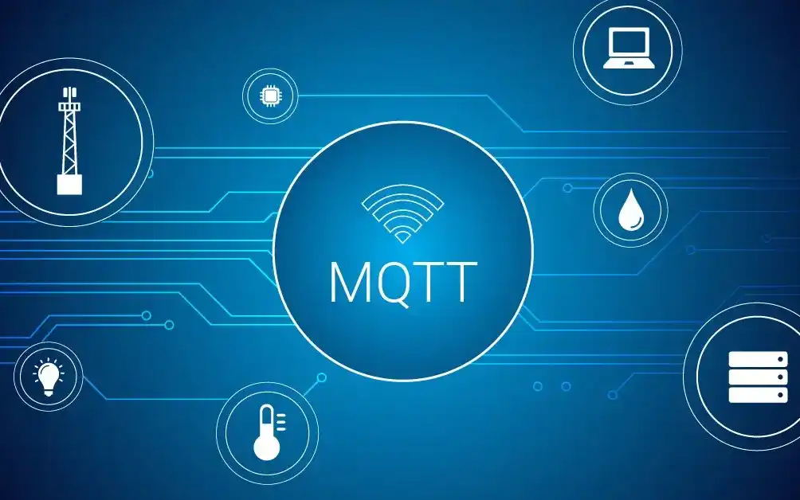
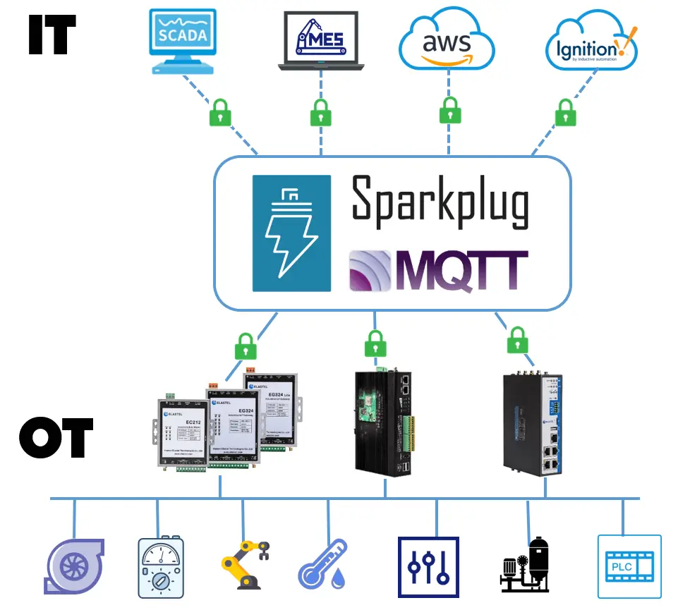

# Integración de Sistemas Embebidos con Servicios Cloud mediante MQTT y Sparkplug B

## Datos 

Nombre: Alexis Sebastian Sanchez Ruano

Número de control: 22211659

Fecha: 30 de Septiembre del 2025

Nickname: SanchezRuano22211659

## 1. Introducción

La **Industria 4.0** y el **Internet Industrial de las Cosas (IIoT)** requieren la integración de datos en tiempo real entre los sistemas operativos (**OT**) en la planta de producción y los sistemas de información (**IT**) en la nube. Sin embargo, los entornos industriales suelen estar compuestos por dispositivos heterogéneos con protocolos propietarios, lo que genera **silos de datos** y una integración compleja . Aunque el protocolo **MQTT** se ha posicionado como un estándar ligero para la comunicación machine-to-machine, por sí solo carece de estandarización en la estructura de los mensajes y la gestión del estado de los dispositivos . **Sparkplug B** surge como una especificación abierta que resuelve estas limitaciones, proporcionando un marco de trabajo estandarizado sobre MQTT que garantiza la **interoperabilidad** y permite una integración perfecta y bidireccional entre los sistemas embebidos en el edge y los servicios cloud .

## 2. Fundamentos Técnicos

### 2.1. MQTT (Message Queuing Telemetry Transport)

MQTT es un protocolo de comunicaciones de tipo **publicar-suscribir** basado en el protocolo TCP/IP. Su arquitectura se compone de un **broker central** (servidor) y múltiples **clientes** (dispositivos o aplicaciones) .

- **Publicar/Suscribir**: Los clientes publican mensajes en "tópicos" específicos en el broker. Otros clientes se suscriben a esos tópicos para recibir la información, creando un sistema de comunicación desacoplado .
- **Calidad de Servicio (QoS)**: MQTT define tres niveles (0, 1 y 2) para garantizar la entrega de mensajes, incluso en redes inestables .
- **Reporte por Excepción (Report by Exception)**: Los dispositivos solo envían datos cuando hay un cambio en el valor, lo que reduce drásticamente el consumo de ancho de banda en comparación con los protocolos basados en sondeo continuo (polling) .

### 2.2. Sparkplug B

Sparkplug B es una **especificación de código abierto** mantenida por la Eclipse Foundation que define cómo los clientes MQTT deben intercambiar datos de forma interoperable en entornos IIoT. Está diseñado específicamente para aplicaciones de misión crítica .

Sus tres pilares fundamentales son:

1.  **Espacio de nombres de tópicos estandarizado**: Define una estructura consistente para los tópicos MQTT .
2.  **Gestión de estado**
    a. Mediante certificados de "nacimiento" y "muerte", proporciona conciencia en tiempo real del estado de todos los dispositivos .
3.  **Formato de payload**
    a. Utiliza **Google Protocol Buffers ** para codificar la información de manera eficiente en un formato binario, reduciendo el tamaño del payload .

## 3. Arquitectura y Componentes Clave

| **Componente** | **Función** | **Responsabilidades Clave** |
| :--- | :--- | :--- |
| **Nodo Edge ** | Fuente de datos | Gateway o dispositivo embebido que se comunica con los activos industriales . Colecta datos y los publica en formato Sparkplug B. |
| **Broker MQTT** | Distribución de mensajes | El centro de comunicaciones. Gestiona la autenticación, la entrega de mensajes y publica los certificados de muerte. |
| **Aplicación Host ** | Consumidor de datos | Servicios cloud, SCADA, MES o ERP que se suscriben a los tópicos Sparkplug B para consumir los datos industriales. |

### 3.1. Estructura de Tópicos de Sparkplug B

Sparkplug B define un espacio de nombres estricto para los tópicos, lo que permite la auto-descubribilidad  de dispositivos y datos . La estructura sigue el patrón:

`spBv1.0/<Group ID>/<Message Type>/<Edge Node ID>[/<Device ID>]`

- **`spBv1.0`**: Namespace que identifica la versión del protocolo Sparkplug B.
- **`Group ID`**: Identifica un grupo lógico de nodos.
- **`Message Type`**: Especifica el propósito del mensaje. Los tipos clave son:
    - **`NBIRTH`/`DBIRTH`**: Certificado de "nacimiento" del Nodo o Dispositivo. Se envía al conectar e incluye todas las métricas que reportará.
    - **`NDEATH`/`DDEATH`**: Certificado de "muerte". Notifica una desconexión.
    - **`NDATA`/`DDATA`**: Mensaje de datos del Nodo o Dispositivo.
    - **`NCMD`/`DCMD`**: Mensaje de comando para controlar un Nodo o Dispositivo .
- **`Edge Node ID`**: Identificador único del nodo edge.
- **`Device ID`**:  Identificador de un dispositivo conectado al nodo edge.

### 3.2. Gestión de Estado con Certificados Birth y Death

Este es un mecanismo fundamental para la confiabilidad en entornos industriales.

- **Certificado de Nacimiento **: Cuando un **nodo edge** se conecta, publica inmediatamente un mensaje `NBIRTH`. Este mensaje anuncia que está en línea y contiene una lista completa de todas las **métricas**  que va a reportar, junto con sus tipos de dato y valores iniciales . Esto permite que las aplicaciones host lo descubran y configuren automáticamente.
- **Certificado de Muerte **: Si un nodo se desconecta inesperadamente, el broker MQTT publica automáticamente un mensaje `NDEATH` utilizando el mensaje de **Última Voluntad y Testamento ** configurado previamente por el nodo . Esto proporciona una visibilidad inmediata del estado offline, marcando los datos como "no frescos".

## 4. Beneficios de la Integración con Sparkplug B

- **Interoperabilidad Total**: Al estandarizar el tema y el payload, los dispositivos de diferentes fabricantes pueden intercambiar datos sin necesidad de traducciones o integraciones personalizadas complejas .
- **Eficiencia en el Ancho de Banda**: La combinación del "reporte por excepción" de MQTT y la codificación binaria de Protobuf minimiza el uso de la red, lo que es crucial para entornos con conectividad limitada o costosa .
- **Conciencia de Estado en Tiempo Real**: Los certificados Birth y Death permiten conocer en todo momento qué dispositivos están en línea y comunicándose de manera efectiva, un aspecto crítico para la supervisión industrial .
- **Arquitectura Desacoplada y Escalable**: El patrón publicar/suscribir permite añadir nuevos publicadores  y suscriptores  sin afectar a los componentes existentes, facilitando la escalabilidad .
- **Espacio de Nombres Unificado **: Sparkplug B organiza todos los datos industriales en una estructura de temas común y coherente, creando una **"fuente única de la verdad"** accesible para cualquier aplicación IT u OT .

## 5. Implementación Práctica y Casos de Uso

### 5.1. Configuración de un Entorno Básico

Implementar una solución con Sparkplug B requiere dos componentes principales :

1.  **Un Broker MQTT compatible**: Es fundamental que el broker implemente **completamente el estándar MQTT 3.1.1**, ya que Sparkplug B depende de funcionalidades como los mensajes LWT. **HiveMQ** y **EMQX** son opciones populares. Es importante señalar que algunos servicios cloud como AWS IoT Core y Azure IoT Hub no son adecuados para Sparkplug B debido a la falta de soporte para ciertas funcionalidades MQTT esenciales .
2.  **Un Nodo Edge con soporte para Sparkplug B**: Este puede ser un gateway industrial  o software personalizado que se ejecute en un sistema embebido. Su función es recopilar datos de los dispositivos subyacentes  y traducirlos al formato Sparkplug B para su publicación .

### 5.2. Flujo de Datos Típico

1.  **Inicialización**: El nodo edge se conecta al broker, enviando su mensaje `NBIRTH`.
2.  **Descubrimiento**: Las aplicaciones host  suscritas al grupo correspondiente reciben el `NBIRTH` y descubren automáticamente todas las métricas disponibles.
3.  **Operación Normal**: El nodo edge publica mensajes `DDATA` o `NDATA` solo cuando los valores de las métricas cambian.
4.  **Control**: Una aplicación host puede enviar un comando publicando un mensaje `DCMD` a la dirección  adecuada.
5.  **Gestión de Estado**: En caso de desconexión, el broker publica el `NDEATH`, notificando a todas las aplicaciones suscritas.

### 5.3. Casos de Uso en la Industria

- **Monitoreo Remoto de Activos**: En la industria Oil & Gas, permite supervisar equipos en plataformas offshore con conectividad satelital limitada, gracias a la eficiencia de bandwidth de Sparkplug B .
- **Manufactura Inteligente**: Las fábricas pueden integrar datos de PLCs, robots y sensores en un namespace unificado, permitiendo que sistemas MES y ERP en la cloud consuman datos en tiempo real para análisis y toma de decisiones .
- **Integración con Cloud Pública**: Soluciones como el "IoT Bridge for AWS IoT Sitewise" permiten traducir mensajes Sparkplug B en modelos de assets de AWS, automatizando la creación de representaciones digitales de los activos físicos .

## 6. Comparativa de Sparkplug B vs. OPC-UA

| **Característica** | **Sparkplug B** | **OPC-UA** |
| :--- | :--- | :--- |
| **Modelo de Comunicación** | Publish/Subscribe | Cliente-Servidor  |
| **Eficiencia** | Muy alta  | Menor  |
| **Escalabilidad** | Alta  | Limitada  |
| **Conciencia de Estado** | Nativa  | Requiere polling continuo |
| **Auto-Discovery** | Sí | Los clientes deben preconfigurarse |
| **Direccionalidad** | Bidireccional | Principalmente unidireccional  |
| **Complejidad** | Especificación simple  | Especificación muy compleja |

## 7. Conclusión

La integración de **sistemas embebidos con servicios cloud** mediante **MQTT y Sparkplug B** representa un avance significativo para la IIoT y la Industria 4.0. Sparkplug B resuelve las limitaciones de MQTT plano al estandarizar la estructura de los temas, el formato del payload y, lo que es más importante, la gestión del estado de los dispositivos. Esto resulta en una arquitectura **interoperable, eficiente y confiable** que rompe los silos de datos tradicionales entre el piso de planta (OT) y la nube (IT).

Al proporcionar un **namespace unificado** y **conciencia de estado en tiempo real**, Sparkplug B no solo simplifica enormemente la integración, sino que también sienta las bases para aplicaciones avanzadas como el gemelo digital y la analítica predictiva, permitiendo a las organizaciones industrialess aprovechar todo el potencial de sus datos.

## 8. Referencias

Cirrus Link Solutions. (s. f.). *Sparkplug B MQTT Tutorials*. Recuperado de https://docs.chariot.io/display/CLD79/Sparkplug+B+MQTT+Tutorials 

Obermaier, D. (s. f.). *Introduction to MQTT Sparkplug*. HiveMQ. Recuperado de https://www.hivemq.com/blog/mqtt-sparkplug-essentials-part-1-introduction/ EMQ. (2024, 6 febrero). *MQTT Sparkplug: Bridging IT and OT for IIoT in Industry 4.0*. Recuperado de https://www.emqx.com/en/blog/mqtt-sparkplug-bridging-it-and-ot-in-industry-4-0 

Corso Systems. (s. f.). *MQTT and Sparkplug B Simplified*. Recuperado de https://corsosystems.com/posts/mqtt-and-sparkplug-b-simplified 

Manditereza, K. (2022, 15 julio). *The Key Differences Between OPC UA And MQTT Sparkplug*. HiveMQ. Recuperado de https://www.hivemq.com/blog/iiot-protocols-opcua-vs-mqtt-sparkplug-digital-transformation/ 

HiveMQ. (s. f.). *Building Powerful Industrial IoT Systems with MQTT Sparkplug*. Recuperado de https://www.hivemq.com/solutions/technology/mqtt-sparkplug/ 

Eastburn, J. (2020, 26 agosto). *How to Integrate Automation Data with MQTT - Sparkplug B*. MBT Magazine. Recuperado de https://www.mbtmag.com/industry-4-0/article/21172575/how-to-integrate-automation-data-with-mqttsparkplug-b 

EMQ. (2024, 11 febrero). *MQTT Sparkplug in Action: A Step-by-Step Tutorial*. Recuperado de https://www.emqx.com/en/blog/mqtt-sparkplug-in-action-a-step-by-step-tutorial 

Bevywise. (2018, 17 noviembre). *realtime Data Simulation using IoT Simulator MQTT Sparkplug*. Recuperado de https://www.bevywise.com/blog/sparkplug-b-mqtt-simulation/ 

Open Automation Software. (s. f.). *How to Access Sparkplug B Data Via MQTT*. Recuperado de https://openautomationsoftware.com/knowledge-base/how-to-sparkplug-b-mqtt/ 
