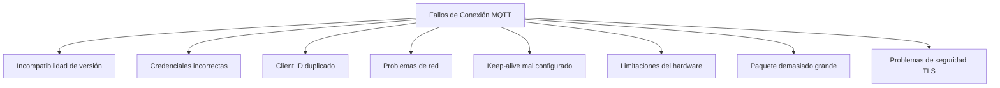
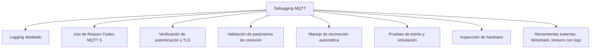

# Técnicas de Debugging para Fallas de Conexión MQTT en Controladores y FPGAs
### Fecha: 01/10/2025
### Nombre: Ernesto Torres Pineda 
### No. Control: 22211665

## Introducción
Los controladores embebidos y las **FPGAs (Field Programmable Gate Arrays)** se utilizan cada vez más en aplicaciones de **Internet de las Cosas (IoT)**, automatización industrial y sistemas en tiempo real.  
**MQTT** (y especialmente **MQTT 5**) es ideal para esos entornos por su eficiencia y ligereza.  
Sin embargo, las fallas de conexión (desconexiones, rechazos de conexión, tiempos muertos, errores de autenticación) son comunes y deben diagnosticarse con cuidado.  

Este documento presenta causas típicas, técnicas de depuración y estrategias específicas para dispositivos embebidos y FPGAs.

---

## Causas Comunes de Fallas de Conexión

| Causa | Descripción |
|-------|-------------|
| **Incompatibilidades de versión** | Cliente y broker usan diferentes versiones de MQTT. En MQTT 5, algunas propiedades o Reason Codes pueden no estar soportados. |
| **Credenciales incorrectas** | Usuario/contraseña inválidos, certificados TLS no válidos o caducados. |
| **Client ID duplicado** | IDs repetidos generan desconexiones o rechazo de sesión. |
| **Problemas de red** | Latencia, pérdida de paquetes, Wi-Fi inestable o cortes eléctricos. |
| **Keep-alive mal configurado** | Intervalos demasiado cortos o cliente que no envía pings. |
| **Limitaciones del hardware** | Poca memoria, buffers insuficientes, interrupciones mal gestionadas en FPGA o microcontrolador. |
| **Tamaño de paquete excesivo** | MQTT 5 incluye la propiedad *Maximum Packet Size*; si se excede, la conexión falla. |
| **Problemas de seguridad TLS** | Certificados caducados, SAN incorrecto, cifrado no soportado por el hardware. |

## Diagrama: Causas de Fallas de Conexión


---

## Técnicas de Debugging

### 1. Logging detallado
- Habilitar registros en el cliente MQTT: intentos de conexión, paquetes `CONNACK`, eventos de desconexión.  
- Usar distintos niveles (INFO, DEBUG, ERROR).  
- Registrar también métricas de red.

### 2. Uso de Reason Codes en MQTT 5
- Inspeccionar los **Reason Codes** devueltos en `CONNACK` y `DISCONNECT`.  
- Identificar la causa: `Not authorized`, `Unsupported protocol version`, `Packet too large`, etc.  
- Facilita saber si el problema está en el cliente o en el broker.

### 3. Verificación de autenticación y seguridad
- Comprobar certificados y algoritmos soportados.  
- Probar conexión sin TLS para descartar errores en el handshake.  

### 4. Validación de parámetros
- Asegurar un `ClientID` único.  
- Configurar correctamente `Clean Start`, `Session Expiry` y `Keep Alive`.  
- Verificar límites de propiedades y tamaño de mensajes.  

### 5. Manejo de reconexión automática
- Implementar reconexión con **backoff exponencial** para evitar sobrecarga.  
- Detectar pérdida de enlace de red antes de reconectar.  

### 6. Pruebas de estrés
- Simular pérdida de red, latencia o fallos del broker.  
- Evaluar cómo responde el cliente en condiciones adversas.  

### 7. Inspección de hardware
- Verificar consumo de memoria, buffers, interrupciones en FPGAs y controladores.  
- Identificar bloqueos de CPU que impidan responder a pings.  

### 8. Herramientas externas
- Captura de paquetes con **Wireshark** para analizar tráfico TCP/MQTT.  
- Uso de brokers con logging detallado (ej. HiveMQ, Mosquitto).  
- Verificación cruzada de cliente con otros brokers.


---

## Relación con *MQTT 5 Essentials*
El libro **MQTT 5 Essentials** aporta ideas directamente aplicables al debugging:

- Los **Reason Codes** son clave para identificar causas de error con precisión.  
- Parámetros como *Session Expiry Interval*, *Maximum Packet Size*, *Topic Aliases* y *Flow Control* pueden generar fallas si se configuran mal.  
- Recalca la importancia de ajustar correctamente el **keep-alive** y manejar la **reconexión automática** en redes poco confiables.  
- Recomienda optimizar el tamaño de mensajes y evitar propiedades no soportadas por el broker.

---

## Ejemplo de Flujo de Debugging
1. Confirmar versión de cliente y compatibilidad con el broker.  
2. Revisar el paquete `CONNACK` y sus Reason Codes.  
3. Verificar unicidad de `ClientID`.  
4. Deshabilitar temporalmente propiedades opcionales para descartar fallos.  
5. Ajustar parámetros de keep-alive y ping.  
6. Probar conexión con y sin TLS.  
7. Monitorear memoria, buffers y uso de CPU en el dispositivo.  
8. Ajustar configuración y validar la corrección con pruebas de estrés.  

```mermaid
flowchart LR
    A[Inicio Debugging] --> B[Confirmar versión cliente/broker]
    B --> C[Revisar CONNACK + Reason Codes]
    C --> D[Verificar ClientID único]
    D --> E[Deshabilitar propiedades opcionales]
    E --> F[Ajustar Keep-Alive y ping]
    F --> G[Probar con y sin TLS]
    G --> H[Monitorear recursos HW]
    H --> I[Ajustar configuración]
    I --> J[Pruebas de estrés]
    J --> K[Problema resuelto]
```


---

## Ejemplos de Debugging con Código

### 1. Ejemplo en Python (Raspberry Pi / Controlador)
Este código usa la librería `paho-mqtt` y muestra cómo capturar **Reason Codes** y eventos de conexión.

```python
import paho.mqtt.client as mqtt

# Callback al conectarse
def on_connect(client, userdata, flags, rc, properties=None):
    if rc == 0:
        print("Conexión exitosa al broker MQTT")
    else:
        print(f"Fallo en conexión. Reason Code: {rc}")

# Callback al desconectarse
def on_disconnect(client, userdata, rc):
    print(f"Desconectado del broker. Código: {rc}")

# Crear cliente MQTT con un ClientID único
client = mqtt.Client(client_id="raspberry_pi_01", protocol=mqtt.MQTTv5)

# Configuración de credenciales (si aplica)
client.username_pw_set("usuario", "contraseña")

# Asignar callbacks
client.on_connect = on_connect
client.on_disconnect = on_disconnect

# Intentar conexión al broker
try:
    client.connect("broker.hivemq.com", 1883, keepalive=30)
    client.loop_forever()
except Exception as e:
    print("Error de conexión:", str(e))
```
### 2. Ejemplo en C (Microcontrolador con ESP32)

Uso del stack MQTT de Espressif-IDF con manejo de reconexiones.

``` c
#include "mqtt_client.h"

static void mqtt_event_handler(void *handler_args, esp_event_base_t base, int32_t event_id, void *event_data) {
    esp_mqtt_event_handle_t event = event_data;
    switch ((esp_mqtt_event_id_t)event_id) {
        case MQTT_EVENT_CONNECTED:
            printf("MQTT conectado\n");
            break;
        case MQTT_EVENT_DISCONNECTED:
            printf("MQTT desconectado, intentando reconectar...\n");
            // Aquí se puede implementar backoff exponencial
            break;
        case MQTT_EVENT_ERROR:
            printf("Error en conexión MQTT\n");
            break;
        default:
            break;
    }
}

void app_main(void) {
    esp_mqtt_client_config_t mqtt_cfg = {
        .uri = "mqtt://broker.hivemq.com",
        .client_id = "esp32_device_01",
    };

    esp_mqtt_client_handle_t client = esp_mqtt_client_init(&mqtt_cfg);
    esp_mqtt_client_register_event(client, ESP_EVENT_ANY_ID, mqtt_event_handler, client);
    esp_mqtt_client_start(client);
}
```
Debugging clave:

- Verificar reconexiones automáticas en MQTT_EVENT_DISCONNECTED.
- Implementar temporizador para reconexión con backoff exponencial.
- Revisar logs seriales del ESP32 para códigos de error.

### 3. Ejemplo en VHDL (FPGA con interfaz TCP/MQTT simplificada)
En FPGA no existe librería directa MQTT, pero se suele implementar un cliente mínimo. Aquí un fragmento conceptual en VHDL que muestra cómo detectar un timeout de keep-alive.
``` vhdl
process(clk)
begin
    if rising_edge(clk) then
        if keepalive_counter = MAX_KEEPALIVE then
            state <= SEND_PINGREQ; -- Enviar ping al broker
        elsif timeout_detected = '1' then
            state <= RECONNECT; -- Reiniciar conexión
        end if;
    end if;
end process;
```
Debugging clave:

- Monitorear el contador de keep-alive para asegurar que se envíen PINGREQ.
- Implementar un estado de RECONNECT si no se recibe PINGRESP.
- Probar con simulación (ModelSim/Questa) antes de cargar en la FPGA.

---

## Conclusiónes
- Las fallas de conexión MQTT en controladores y FPGAs pueden deberse tanto a limitaciones de hardware como a errores de configuración.  
- **MQTT 5** facilita el diagnóstico mediante **Reason Codes** y nuevas propiedades de sesión.  
- Con un enfoque estructurado de logging, validación, pruebas de estrés y monitoreo de hardware, la mayoría de los problemas se pueden identificar y resolver.  

---

## Referencias
- HiveMQ. (2019). *MQTT 5 Essentials: A comprehensive overview of MQTT facts and features for beginners and experts alike*.  
- EMQX. (2023). *Reason Code in MQTT 5.0: How to identify errors in MQTT connections*.  
- Ellenex. (2024). *MQTT explained: Basics, challenges, solutions, and real-world examples*.  
- Particle.io. (2024). *MQTT 5 Library for Device OS: Debugging and error handling*.  
- Boost C++ Libraries. (2024). *MQTT 5 Error Handling Documentation*. 
