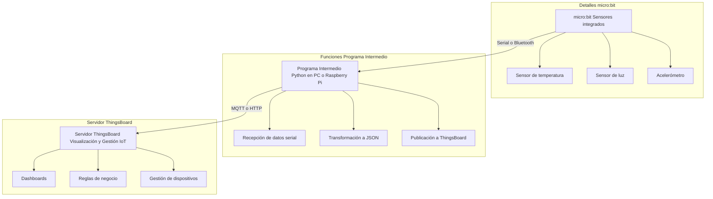

🌍 **Thingsboard.io en un vistazo en 10 minutos como alternativa Open Source** 🚀

Video: https://youtu.be/GzBy2ke8wwc?si=St6KATVss32YJfxE

En el mundo actual, donde el Internet de las Cosas (IoT) está revolucionando industrias enteras —desde la agricultura hasta las ciudades inteligentes—, es fundamental que los estudiantes de ingeniería y tecnología conozcan plataformas que permitan desarrollar soluciones reales, escalables y seguras. Una de las mejores oportunidades que tienes para aprender e innovar **sin depender de soluciones privativas o costosas** es **ThingsBoard**, una plataforma **Open Source** que puedes explorar desde:

🔗 [www.thingsboard.io](https://www.thingsboard.io)  
🔧 [github.com/thingsboard/thingsboard](https://github.com/thingsboard/thingsboard)

**¿Por qué ThingsBoard?**  
Porque es una herramienta profesional de código abierto que te permite:

- 📶 Conectar sensores y dispositivos físicos con la nube  
- 📊 Visualizar datos en tiempo real con dashboards personalizables  
- ⚙️ Automatizar procesos usando reglas de negocio  
- 🔐 Gestionar dispositivos de forma segura y escalable  
- 🌐 Desplegar tus propias soluciones sin pagar licencias
- Git repositorio publico y comunitario feedback

**¿Qué aprenderás?**  
Al trabajar con ThingsBoard, no solo conocerás más sobre IoT, sino también sobre:

- Protocolos como MQTT, HTTP y CoAP  
- Bases de datos de series de tiempo  
- Arquitecturas cliente-servidor  
- Desarrollo web y backend  
- Seguridad en dispositivos conectados

💡 *Motívate a explorar esta plataforma que usan empresas reales alrededor del mundo. Al aprender con ThingsBoard, no solo mejoras tus habilidades técnicas, sino que te preparas para resolver problemas reales con soluciones modernas, libres y colaborativas.* 🌱

Animarse usar su beca AWS e instalar tu propio servidor ThingsBoard y comenzar a construir el proyecto del IoT con su microbit-RasPi-ESP32 🌐👨‍💻👩‍💻

---

🧠 **Justificación del uso de micro:bit como dispositivo de adquisición de datos y la necesidad de un programa intermedio para conectarlo con ThingsBoard.io** 🌐📲

El uso de tecnologías de bajo costo y fácil acceso es esencial para el aprendizaje práctico y la implementación de sistemas reales en entornos educativos. En este contexto, el **micro:bit** se presenta como una plataforma ideal para la **adquisición de datos en proyectos de IoT**, gracias a sus sensores integrados (temperatura, acelerómetro, luz, etc.) y su facilidad de programación.

### 🎯 **¿Por qué usar micro:bit para adquisición de datos?**

1. ✅ **Accesibilidad y bajo costo:** Ideal para proyectos educativos y prototipado rápido.  
2. 🔌 **Sensores integrados y expansión sencilla:** Permite capturar variables del entorno como temperatura, movimiento o luz sin hardware adicional.  
3. 💻 **Programación amigable:** Compatible con MicroPython, lo que facilita el aprendizaje y la personalización del código.  
4. 🔋 **Portabilidad:** Puede funcionar con baterías, lo cual es útil para aplicaciones móviles o de campo.

### 🔄 **¿Por qué se necesita un programa intermedio?**

ThingsBoard.io es una plataforma profesional para gestión y visualización de datos IoT, que **requiere comunicación mediante protocolos como MQTT o HTTP**. El micro:bit, por sí solo, **no cuenta con conectividad a Internet ni con una pila de red completa**, por lo que necesita un **puente intermedio**.

Este programa intermedio puede correr en una **computadora con Python o en una Raspberry Pi**, y cumple funciones como:

- 🧲 **Recibir datos del micro:bit** vía puerto serial o Bluetooth  
- 🔁 **Formatear y transformar los datos** en un formato aceptado por ThingsBoard (JSON, por ejemplo)  
- 🌐 **Publicar los datos a ThingsBoard** usando MQTT o HTTP

## 🧩 Descripción de los Componentes

### micro:bit:
- Dispositivo de bajo costo con sensores integrados (temperatura, luz, acelerómetro, etc.).
- Ideal para proyectos educativos y prototipado rápido.
- Carece de conectividad directa a Internet, por lo que necesita un intermediario para enviar datos a la nube.

### Programa Intermedio:
- Puede ser una **Raspberry Pi** o una **computadora** con capacidad de ejecutar scripts en Python.
- Funciona como puente entre el micro:bit y ThingsBoard.
- Recibe datos del micro:bit vía **USB (serial)** o **Bluetooth**.
- Procesa y transforma los datos en formato **JSON**.
- Envía los datos a ThingsBoard utilizando protocolos como **MQTT** o **HTTP**.

### Servidor ThingsBoard:
- Plataforma de **código abierto** para gestión y visualización de datos IoT.
- Permite crear **dashboards personalizados**, establecer **reglas de negocio** y gestionar dispositivos.
- Puede ser alojado **localmente** o en la **nube**.

---

## 🌐 Flujo de Datos

1. **Adquisición**:  
   El micro:bit recoge datos del entorno a través de sus sensores integrados.

2. **Transmisión Local**:  
   Los datos se envían al programa intermedio mediante conexión serial o Bluetooth.

3. **Procesamiento**:  
   El programa intermedio formatea los datos en JSON y los prepara para su envío.

4. **Envío a la Nube**:  
   Utilizando MQTT o HTTP, los datos se transmiten al servidor ThingsBoard.

5. **Visualización y Gestión**:  
   En ThingsBoard, los datos se visualizan en tiempo real, se almacenan y se pueden utilizar para activar alertas o acciones automatizadas.

