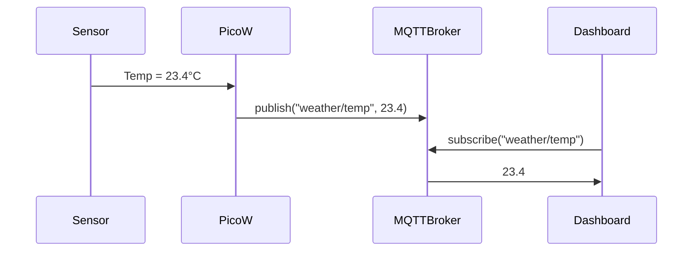
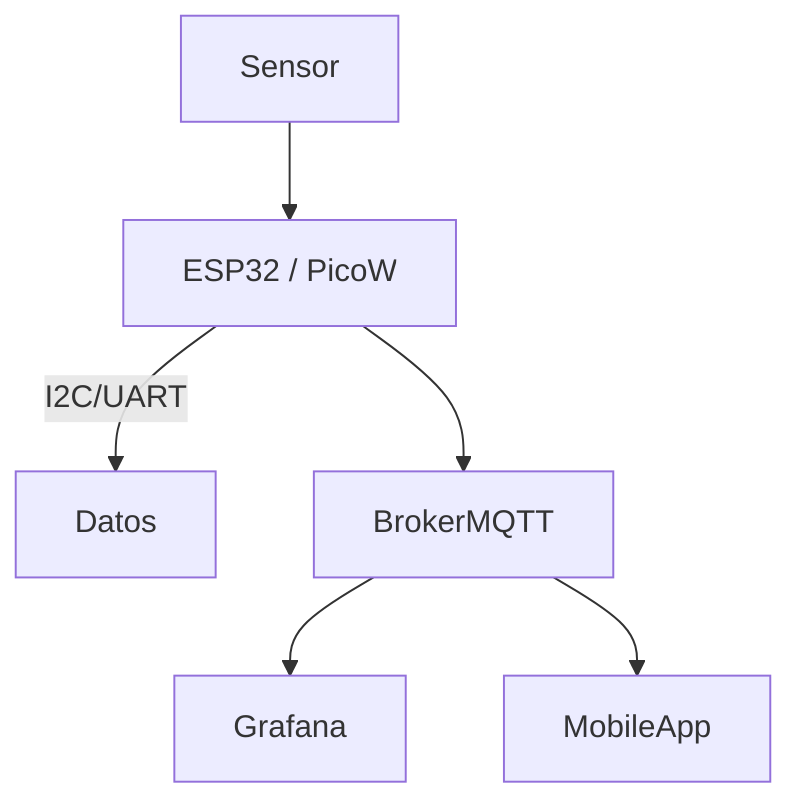

# 🧠 **Lección: Protocolos de Comunicación para Sensores**

---

## **📘  Fundamentos de Comunicación en Sistemas Embebidos**

### 1. ¿Por qué necesitamos protocolos?
- Los sensores no pueden trabajar solos: necesitan comunicarse con microcontroladores, gateways o la nube.
- Los protocolos definen **cómo se transmiten los datos**, **en qué formato**, y **quién escucha o responde**.

### 2. Clasificación general
| Tipo | Ejemplos | Capa OSI |
|------|----------|----------|
| Serial punto a punto | UART, RS232, RS485 | Física, Enlace |
| Comunicación por buses | I2C, SPI, 1-Wire | Física, Enlace |
| Comunicación inalámbrica | BLE, ZigBee, LoRa, Wi-Fi | Física, Red, Transporte |
| Protocolos de red | MQTT, HTTP, CoAP | Transporte, Aplicación |

### 3. Enfoque en buses de sensores
#### ➤ I2C (Inter-Integrated Circuit)
- 2 cables: SDA (datos), SCL (reloj)
- Multi-maestro / multi-esclavo
- Usado en sensores como BME280, MPU6050
- Velocidades comunes: 100 kHz, 400 kHz
- Dirección de 7 bits

#### ➤ SPI (Serial Peripheral Interface)
- 4 cables: MISO, MOSI, SCK, CS
- Más rápido que I2C (~10 Mbps)
- Comunicación full duplex
- Muy usado en sensores rápidos: IMUs, ADCs, memorias Flash

#### ➤ UART (Universal Asynchronous Receiver-Transmitter)
- Comunicación punto a punto (RX/TX)
- Usado en GPS, sensores seriales industriales
- Simple pero no tolera múltiples dispositivos en un bus

---

## **🧪 Parte 2: Protocolos de Alto Nivel y Aplicaciones con MQTT**

### 1. Comunicación orientada a IoT
Aquí los sensores no solo hablan con microcontroladores, sino con la **nube**, aplicaciones web o bases de datos.

### 2. Protocolos comunes de capa de aplicación
#### ➤ MQTT (Message Queuing Telemetry Transport)
- Basado en publish/subscribe
- Muy ligero, ideal para sensores remotos
- Usa TCP/IP (puerto 1883)
- Compatible con plataformas como Flespi, Mosquitto, AWS IoT



#### ➤ CoAP (Constrained Application Protocol)
- Protocolos RESTful sobre UDP
- Muy usado en dispositivos con energía limitada (LPWAN)
- Similar a HTTP pero más eficiente

#### ➤ HTTP/HTTPS
- Más pesado pero universal
- Adecuado para dispositivos con buena conexión (Wi-Fi)
- Ideal si se usan API REST en el backend

---

## **🔬 Parte 3: Casos Reales, Comparaciones y Buenas Prácticas**

### 1. ¿Cuál protocolo elegir?
| Criterio | I2C | SPI | UART | MQTT | CoAP |
|---------|-----|-----|------|------|------|
| Facilidad de conexión | Alta | Media | Alta | Alta | Media |
| Velocidad | 400 kbps | 10 Mbps | 115 kbps | Depende de red | Variable |
| Energía | Baja | Media | Baja | Baja | Muy baja |
| Tolerancia a ruido | Media | Alta | Alta | Alta | Alta |

### 2. Ejemplo de sistema completo:
- Sensor DHT22 conectado a ESP32 por GPIO
- ESP32 transmite datos vía MQTT usando Wi-Fi
- MQTT broker en una Raspberry Pi (Mosquitto + Grafana)
- Visualización en tiempo real

### 3. Buenas prácticas
- **Evita polling constante**: usa interrupciones si es posible
- **Agrupa datos** antes de enviarlos por MQTT para ahorrar ancho de banda
- Usa **QoS adecuado** (0 para sensores frecuentes, 1 o 2 para críticos)
- **Encripta si es remoto** (usa TLS en MQTT o HTTPS)

---

¡Perfecto! Aquí tienes la **segunda parte de la lección** sobre *Protocolos de Comunicación para Sensores*, centrada ahora en la **implementación práctica con microcontroladores** y la **simulación de problemas reales** en entornos de IoT.

---

# 🎓 Aplicaciones Prácticas y Retos Reales de Comunicación

---

## **🔧 1. Implementación con microcontroladores (Raspberry Pi Pico W / ESP32)**

### a) **Conexión y lectura básica de sensores**
#### Sensor I2C – BME280
```python
# MicroPython con Raspberry Pi Pico W
from machine import I2C, Pin
import bme280

i2c = I2C(0, scl=Pin(21), sda=Pin(20))
sensor = bme280.BME280(i2c=i2c)

print(sensor.read_compensated_data())  # (temp, pressure, humidity)
```

#### Sensor UART – GPS (NEO-6M)
```python
from machine import UART
import time

uart = UART(1, baudrate=9600, tx=Pin(4), rx=Pin(5))
while True:
    if uart.any():
        line = uart.readline()
        if b'GGA' in line:
            print(line)
```

---

## **🌐 2. Publicación en la nube con MQTT**

### a) MQTT con `umqtt.simple` desde ESP32 (MicroPython)
```python
import network, time
from umqtt.simple import MQTTClient

client = MQTTClient("esp32", "broker.hivemq.com")
client.connect()
client.publish(b"iot/temperature", b"24.5")
client.disconnect()
```

### b) Arquitectura típica de IoT con MQTT


---

## **🛠 3. Problemas comunes en comunicación y cómo resolverlos**

| Problema | Causa común | Solución |
|---------|-------------|----------|
| 🟥 Datos corruptos | Fallos I2C o ruido en SPI | Pull-up resistors, blindaje |
| ⏳ Timeout de sensor | Baudrate incorrecto en UART | Verifica baudrate y pines |
| 📉 Desincronización MQTT | Perdida Wi-Fi | Implementar reintentos y buffer |
| 🧪 Latencia elevada | Protocolo ineficiente | Usar CoAP o MQTT con QoS 0 |

---

## **📈 4. Simulación de Datos y Anomalías**

### a) Datos simulados con picos
```python
import random
def get_sensor_data():
    value = random.uniform(20.0, 25.0)
    if random.random() < 0.05:
        return value + random.uniform(10.0, 20.0)  # Pico falso
    return value
```

💡 **Reto para el alumno**:
> ¿Cómo filtrar estos valores atípicos antes de enviarlos al broker MQTT?

---

## **🧩 5. Ejercicio práctico**

> **Objetivo**: Construir una red de sensores con ESP32 que:
> - Lea temperatura por I2C (BME280)
> - Publique cada 10 segundos en un tópico MQTT
> - Detecte si hay un valor fuera de rango (>50°C) y lo publique en un tópico de alerta

📌 **Condiciones:**
- El sistema usa Wi-Fi con caídas esporádicas (simular delay)
- No se deben enviar más de 1 mensaje por segundo al broker
- Visualiza los datos con Node-RED o Grafana (extra para alumnos avanzados)

---

## **📚 Lecturas sugeridas**
- *IoT Fundamentals with a Practical Approach* – Capítulo 2 y 3
- *Mastering Python for IoT Development* – Capítulo 7 (MQTT en la nube)
- *Raspberry Pi IoT in Python Using GPIO Zero* – Capítulo 5: On/Off Devices
